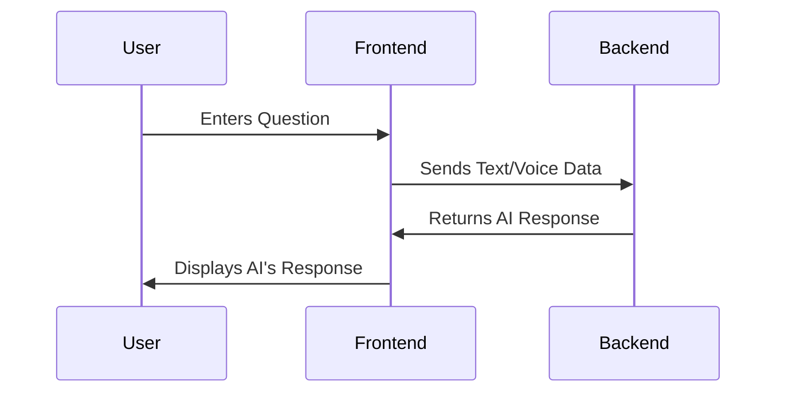

Yes, you can absolutely use the documentation in a `README.md` file on GitHub! GitHub's markdown renderer supports various features, including headings, code blocks, tables, and even diagrams (via Mermaid.js or embedding images). Here's how to structure your `README.md`:

---

### **Structured README Example**

```markdown
# AI Mode Component Documentation

## File Overview
This React component manages the interaction flow between the user and an AI service.

### Component Path
`src/components/landing/chat/mods/AiMode.jsx`

---

## Backend Interaction

### State Management
The component uses the following states:
- **`questionData`**: Stores the user's question as text or voice.
- **`aiResponse`**: Stores the AI's response.

### API Integration
Replace the placeholder `API_ENDPOINT` with the backend endpoint to fetch AI responses.

```javascript
const response = await fetch("API_ENDPOINT", {
  method: "POST",
  headers: { "Content-Type": "application/json" },
  body: JSON.stringify(sendingData),
});
```

### Request/Response Structure
- **Request**:
```json
{
  "text": "Hello AI",
  "voice": null
}
```

- **Response**:
```json
{
  "text": "Hello there!",
  "voice": null
}
```

---

## UI Modes
The component dynamically renders UI based on `aiMode`:
- **Listening**: `<Listening />`
- **Waiting**: `<Waiting />`
- **Thinking**: `<Thinking />`
- **Speaking**: `<Speaking />`

---

## Sequence Diagram
You can visualize the flow as follows:



> **Note**: GitHub does not natively render Mermaid.js diagrams. For diagrams, you can:
> 1. Embed an image of the diagram (use a tool like [Mermaid Live Editor](https://mermaid-js.github.io/mermaid-live-editor)).
> 2. Add instructions for readers to view the diagram using external tools.

---

## How to Integrate with Backend

### Steps:
1. **Replace API Endpoint**:
   Update the `API_ENDPOINT` in the `handleSendQuestion` function:
   ```javascript
   const response = await fetch("https://your-backend-api.com/ask-ai", {
     method: "POST",
     headers: { "Content-Type": "application/json" },
     body: JSON.stringify({
       text: questionData.text,
       voice: questionData.voice
     }),
   });
   ```

2. **Backend Expectations**:
   - Accepts a JSON payload with `text` and `voice`.
   - Returns a JSON response with `text` and `voice`.

---

## Developer Notes
- Ensure the backend response time is minimized to improve the user experience during the "thinking" phase.
- Handle errors gracefully to avoid breaking the frontend.

---

## License
[MIT](LICENSE)
```

---

### **How to Make it More Interactive**
- **Embed Visuals**: Include screenshots of your frontend UI or sequence diagrams.
- **Use Tables**: For clarity in request/response details:
  | Field         | Type         | Description                          |
  |---------------|--------------|--------------------------------------|
  | `text`        | `string`     | User's question in text form         |
  | `voice`       | `string`     | URL or blob for the user's voice input (optional) |
  | `text` (resp) | `string`     | AI's textual response                |
  | `voice` (resp)| `string/null`| URL or blob for AI's voice response (optional) |

---

### **Pushing to GitHub**
1. Add the `README.md` file to your project root.
2. Commit and push:
   ```bash
   git add README.md
   git commit -m "Add AI Mode documentation"
   git push origin main
   ```
3. View the rendered `README` on your GitHub repository.

---

This approach ensures that your documentation is not only clear but also accessible directly from the GitHub repository. You can enhance it further by linking additional resources or adding badges for CI/CD, dependencies, etc.
