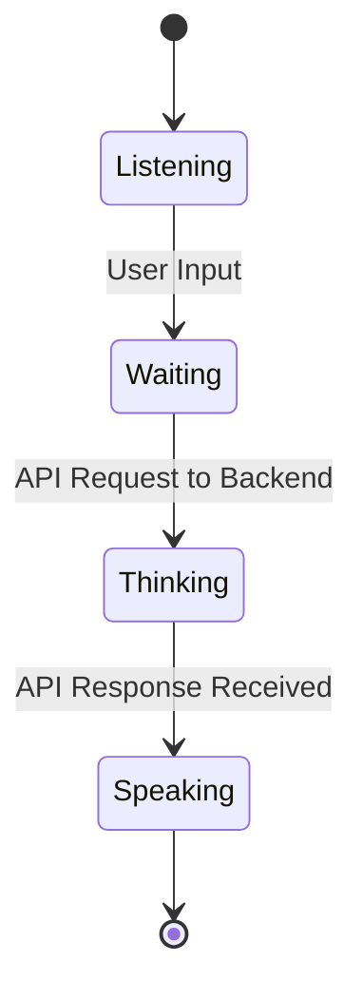
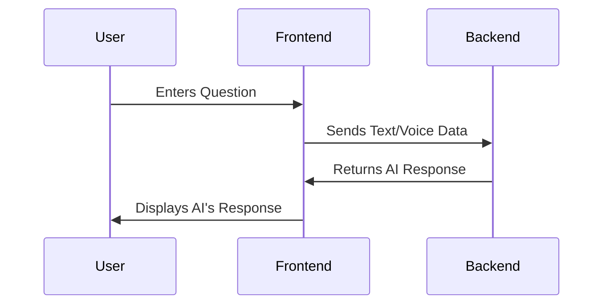

Here’s the updated README with a **Mermaid** diagram for better visualization.

---

# README: Backend Integration for `AiMode.jsx`

## Project: **Vyvo**

### File Location
The file is located at:
```
src/components/landing/chat/mods/AiMode.jsx
```

---

## Overview

`AiMode.jsx` handles the interaction flow between the user and the AI in **Vyvo**. It transitions through various states (listening, waiting, thinking, and speaking), sending the user query to the backend and displaying the AI's response.

This document provides instructions for integrating the backend API with this file.

---

## Key Concepts

1. **AI Modes:**
   - **`listening`**: Captures the user’s query (text or voice).
   - **`waiting`**: Prepares the data and sends it to the backend.
   - **`thinking`**: Shows an animation while waiting for the backend's response.
   - **`speaking`**: Displays the AI’s response (text or voice).

2. **Data Flow:**
   - User’s query (`questionData`) is sent to the backend.
   - Backend processes the query and returns the AI's response (`aiResponse`).
   - Frontend transitions between modes based on the response.

3. **Integration Point:**
   Backend integration is required in the `handleSendQuestion` function.

---

## Backend Integration Code

```javascript
const handleSendQuestion = async () => {
  setGetAnswerLoading(true);

  // Prepare the data to send to the backend
  const sendingData = {
    text: questionData.text, // User's text input
    voice: questionData.voice, // User's voice input (optional)
  };

  try {
    // Send the data to the backend API
    const response = await fetch("<BACKEND_API_ENDPOINT>", {
      method: "POST",
      headers: {
        "Content-Type": "application/json",
      },
      body: JSON.stringify(sendingData),
    });

    const data = await response.json();

    // Update AI response state with the backend's response
    setAiResponse({
      text: data.text, // AI response text
      voice: data.voice, // AI response voice (optional)
    });

    // Transition to the "speaking" mode
    setAiMode("speaking");
  } catch (error) {
    console.error("Error fetching AI response:", error);
  } finally {
    setGetAnswerLoading(false);
  }
};
```

---

## State Diagram



## State Diagram (User & AI)



---

## Backend Developer Instructions

### 1. API Endpoint
Replace `<BACKEND_API_ENDPOINT>` in the `handleSendQuestion` function with the actual backend endpoint to process user queries.

### 2. Request Payload
The frontend sends the following JSON structure to the backend:
```json
{
  "text": "User's question text",
  "voice": "User's voice input (optional)"
}
```

### 3. Response Format
The backend should return the following JSON structure:
```json
{
  "text": "AI's response text",
  "voice": "AI's response voice URL (optional)"
}
```

### 4. Error Handling
Ensure the backend API handles errors gracefully and provides meaningful error messages with appropriate HTTP status codes.

---

## Conclusion

The `AiMode.jsx` file orchestrates the frontend AI interaction flow in Vyvo. Backend developers must integrate their API into the `handleSendQuestion` function to handle user queries and provide responses. Use the state diagram as a reference for understanding the workflow.

For assistance, contact the frontend team.
